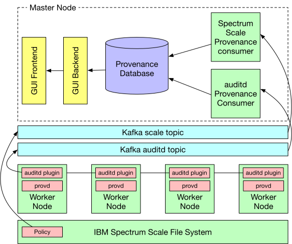

# The Ursprung Provenance Collection System

The Ursprung provenance collection system is a flexible provenance collection framework +
a GUI for tracking machine learning and data science experiments and pipelines in a
cluster.

The collection framework
combines low-level provenance information from system sources (operating and file system)
with application-specific provenance that can be collected through rules in Ursprung's
rule language.

The GUI allows users to navigate the provenance graph and has additional features to
view and compare past pipeline executions.

Ursprung is currently in pre-alpha phase.

## Architecture overview

Ursprung consists of six main components:
1. The provenance consumers
2. The provenance GUI
3. The provenance database
4. The `provd` provenance daemons
5. An [auditd](https://man7.org/linux/man-pages/man8/auditd.8.html) pluging to collect operating system events through Linux's auditing subsystem
6. A Kafka message queue

Below is an overview of how the different components interact with each other.



## Prerequisites


To run Ursprung in your cluster, you need:
- Linux nodes (tested with CentOS and RHEL 8) with auditd installed
- A Kafka deployment
- A Spectrum Scale file system with support for Watch Folder (version 5.0.1 or later)
- Docker support on the master node, i.e. the node that hosts the consumers, provenance database, and GUI

## Building the System

To build Ursprung, clone this repository to a directory on your master node and `cd` into
the cloned directory. It is recommended to run the master node on a separate (virtual)
machine where provenance collection is not required as otherwise, provenance of the
Ursprung system itself will be collected.

**Building the main components**

Ursprung's main components are containerized and can be built through Docker.
All Dockerfiles are located in `deployment`. Before building the actual components the
base image needs to be created through

```
cd deployment
docker build -f Dockerfile.ursprung.build-base -t ursprung-base ../
```

After building the base image, you can build the database image and the collection-system image through

```
docker build -f Dockerfile.ursprung.db -t ursprung-db .
docker build -f Dockerfile.ursprung.collection-system -t ursprung-collection-system ../

```

Currently, the collection-system image contains both the consumer binaries and the `provd` binary.

Before builing the GUI image, you need to create a `.env` file under `gui/backend` with the
following default content

```
PORT=3100
DSN=ursprung-db
HG_REPO=/opt/ursprung/contenttracking
TIME_ERR=1000
```

The default content can be copied as is unless you are using your own database/want the repository
for content tracking under a different location. Once the `.env` file has been created, build the
GUI container image through

```
docker build -f Dockerfile.ursprung.gui -t ursprung-gui ../
```

**Building the auditd plugin**

The `auditd` plugin needs to be available on all cluster node where provenance should be tracked.
You can either build the plugin on one node and copy the binary to the other nodes (given that
the necessary dependencies are installed on these nodes) or build it manually on each cluster
node.

To build the plugin, install the auditd and unixodbc dependencies (the instructions are for CentOS)

```
yum install audit-libs-devel unixODBC-devel
```

The plugin also depends on `librdkafka`. To install `librdkafka`, run the following steps in a
directory of your choice (note that for running `make install` you need to be root).

```
wget https://github.com/edenhill/librdkafka/archive/v1.4.2.tar.gz
tar xzvf v1.4.2.tar.gz
cd librdkafka-1.4.2
./configure
make -j16
make install
```

Once the dependencies are installed, run the following commands from the cloned repository

```
mkdir -p collection-system/build
cd collection-system/build
cmake3 -DCMAKE_BUILD_TYPE=Debug -DBUILD_TESTS=1 -DINFO=1 ../
make
```

This will build the `auditd` plugin under `collection-system/build/auditd-plugin`.

## Deploying Ursprung

To deploy and run Ursprung, you first need to prepare the master node
and then setup the auditd plugin on the rest of the cluster.

**Preparing the master node**

First, create the following directories on your master node

```
mkdir -p /opt/ursprung
mkdir -p /opt/ursprung/config
mkdir -p /opt/ursprung/contenttracking
mkdir -p /opt/ursprung/data
mkdir -p /opt/ursprung/rules
```

Next, create a configuration file for both the `auditd` and `scale` consumer from the
teomplates available in the repository under `deployment/config`. You do not need to change
the database configuration if you're using the database as created in this instruction.
If you're using your own database, you need to set up an ODBC DSN for it and specify
the corresponding details in the consumer configuration. If you're using the default
database, you just need to specify your Kafka brokers and set any authentication
details (if required). You can also leave the default topics but make sure to create
the topics in your Kafka deployment.

A quick way of deploying a single node Kafka instance is through Docker

```
docker run -p 2181:2181 -p 9092:9092 --env ADVERTISED_HOST=your-master-node --env ADVERTISED_PORT=9092 spotify/kafka
```
This starts a Kafka broker (port 9092) and a Zookeeper instance (port 2181) on your master node.

Once you've adapted the configuration templates, copy them to `/opt/ursprung/config`. Start the individual
components through the following commands

```
docker run --name ursprung-db -v /opt/ursprung/data:/var/lib/postgresql/data -p 5432:5432 -it ursprung-db
docker run --name ursprung-scale-consumer -v /opt/ursprung/:/opt/ursprung/ --network host -it ursprung-collection-system /opt/collection-system/build/consumer/prov-consumer -c /opt/ursprung/config/scale-consumer.cfg
docker run --name ursprung-auditd-consumer -v /opt/ursprung/:/opt/ursprung/ --network host -it ursprung-collection-system /opt/collection-system/build/consumer/prov-consumer -c /opt/ursprung/config/auditd-consumer.cfg
docker run --name ursprung-gui-backend -v /opt/ursprung/:/opt/ursprung/ --network host -it ursprung-gui node /opt/gui/backend/app.js
docker run --name ursprung-gui-frontend -p 3000:3000 -it ursprung-gui /bin/bash -c "cd /opt/gui/frontend; npm start" 
```

The GUI should now be available on your master node through a browser under at `http://localhost:3000`. Note that Ursprung
will generate the provenance database (Postgres) under `/opt/ursprung/data` and automatically create the necessary schema.
The data is hence persisted across restarts of the container.

**Preparing the worker nodes**

5. Start provd `docker run -v /opt/ursprung/:/opt/ursprung/ -v /tmp/:/tmp/ --network host --pid host --privileged -it ursprung-collection-system /opt/collection-system/build/provd/provd /opt/ursprung/config/provd.cfg`
